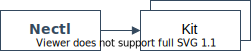
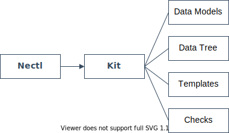

<!--
 Copyright (C) 2022 Adam Kirchberger

 This file is part of Nectl.

 Nectl is free software: you can redistribute it and/or modify
 it under the terms of the GNU General Public License as published by
 the Free Software Foundation, either version 3 of the License, or
 (at your option) any later version.

 Nectl is distributed in the hope that it will be useful,
 but WITHOUT ANY WARRANTY; without even the implied warranty of
 MERCHANTABILITY or FITNESS FOR A PARTICULAR PURPOSE.  See the
 GNU General Public License for more details.

 You should have received a copy of the GNU General Public License
 along with Nectl.  If not, see <http://www.gnu.org/licenses/>.
-->

# Concepts

In order to understand how _nectl_ works it is important to understand the different components.

The tool has two main components.

**1. The _nectl_ tool**

- A Python package which includes the CLI tool and libraries for nectl.
- The CLI is divided into 3 groups
  - `data`: Inventory and datatree actions.
  - `configs`: Host configuration actions.
  - `checks`: Validation actions.

**2. A _kit_ for your environment.**

- A kit is a directory used to define the hosts, facts and templates for an environment.
- A kit can be for a single site, multiple sites or for multiple customers and sites.
- A kit includes data models for your environment.
- A kit includes definitions for all hosts and their facts.
- A kit includes templates to generate configurations for each NOS using your data models.
