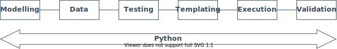

<!--
 Copyright (C) 2022 Adam Kirchberger

 This file is part of Nectl.

 Nectl is free software: you can redistribute it and/or modify
 it under the terms of the GNU General Public License as published by
 the Free Software Foundation, either version 3 of the License, or
 (at your option) any later version.

 Nectl is distributed in the hope that it will be useful,
 but WITHOUT ANY WARRANTY; without even the implied warranty of
 MERCHANTABILITY or FITNESS FOR A PARTICULAR PURPOSE.  See the
 GNU General Public License for more details.

 You should have received a copy of the GNU General Public License
 along with Nectl.  If not, see <http://www.gnu.org/licenses/>.
-->

# Introduction

Network Control, shortened to **nectl**, is an end-to-end Python-based Infrastructure as Code framework for network automation and orchestration.

The motivation behind developing this tool was born from the frustrations of the tools available today for network automation. A project today will use _YANG_ for modelling, _YAML_ for instance data, _Jinja_ for templating, _Ansible_ for playbooks, _Python_ for any custom logic or validation as well as many other additional tools. These different tools and languages can make pipelines slow, require more time invested before you can confidently get any real value and ultimately increase complexity which makes projects fragile and hard to troubleshoot.

So I asked myself:

> **What if there was a way to do it all in Python?**

### Project Goals

- `Easy`: Invest your time in a single language, Python.
- `Flexible`: Python end-to-end allows you to easily extend functionality.
- `Fast`: Avoid any slowdown caused by parsing non-Python files.
- `Simple`: Reduce your dependency tree and toolstack.

### Unique Features

**Facts**

- Facts are defined in a data tree structure which implements inheritance.
- Facts can use functions to pull data from external sources, eg: _netbox_.
- Use pydantic and dataclasses to define your data models and validation.

**Templates**

- Templates are simple to read and write, defined as functions with `print` statements.
- As simple or complex as necessary with if statements, loops and imports.
- No need to create custom Jinja filters using Python, as templates are already in Python.
