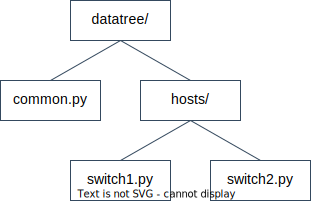
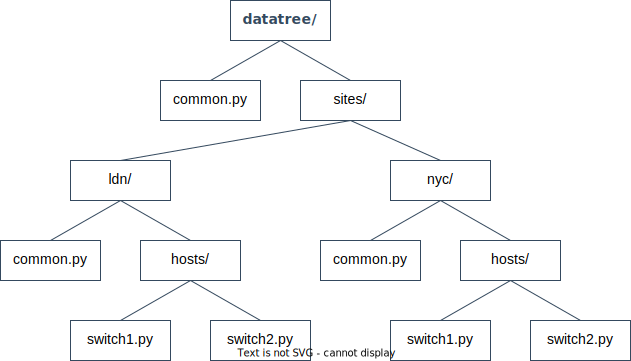
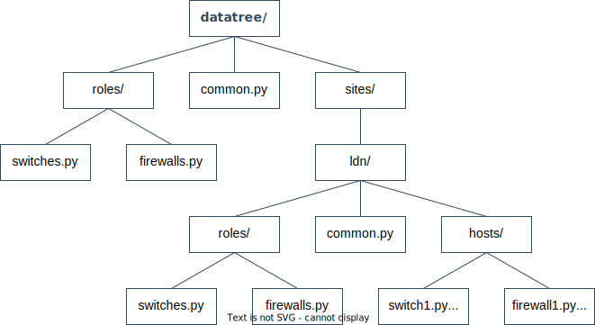

<!--
 Copyright (C) 2022 Adam Kirchberger

 This file is part of Nectl.

 Nectl is free software: you can redistribute it and/or modify
 it under the terms of the GNU General Public License as published by
 the Free Software Foundation, either version 3 of the License, or
 (at your option) any later version.

 Nectl is distributed in the hope that it will be useful,
 but WITHOUT ANY WARRANTY; without even the implied warranty of
 MERCHANTABILITY or FITNESS FOR A PARTICULAR PURPOSE.  See the
 GNU General Public License for more details.

 You should have received a copy of the GNU General Public License
 along with Nectl.  If not, see <http://www.gnu.org/licenses/>.
-->

# Datatree

## Summary

The datatree is where all the hosts that belong to a kit and their facts are defined. The datatree is structured like a tree which enables inheritance of facts at different levels. Facts use data models for schema and validation.

The datatree must be kept in your network kit and be version controlled.

## Structure

The structure of the datatree is entirely up to you. When designing the datatree structure this should be based on how much data there is in common between branch nodes and the way that data for your kit is accessed.

Some examples are provided below to help you get started.

?> It is useful to be aware that leaf nodes in the datatree are Python files, but these can also be directories (each with an `__init__.py`) for larger kits where it makes sense to have multiple files.

### Flat example

In this example there is a kit which has a list of hosts which share some common facts.



The kit above has a

- `common.py`: defines facts which are common across all hosts.
- `hosts/{hostname}.py`: defines per host facts.

### Sites example

In this example there is a kit which has a list of hosts that are grouped by site. Facts can be common to all sites or common to a specific site.



The kit above has a

- `common.py`: defines facts which are common across hosts in all sites.
- `sites/{site}/common.py`: defines facts which are common across hosts in a single site.
- `sites/{site}/hosts/{hostname}.py`: defines per host facts.

## Datatree Actions

Facts which are defined at higher levels in the datatree can be overwritten or modified at lower levels in the tree. This enables inheritance of facts and avoids duplicating data which is one of the most powerful features of the datatree.

There are 3 actions that can be used on facts

- `frozen`: this action states that a fact cannot be modified lower down the tree.
- `replace_with`: this action will replace a fact with a value lower down the tree.
- `merge_with`: this action will merge a fact (list/dict) with a value lower down the tree.

?> The frozen action can be useful where a fact must be enforced for security or compliance and should not be overridden for any reason.

The datatree actions are implemented using type annotations.

!> The default action is `replace_with`, this can be overridden in your kit [settings file](guide/settings.md).

### Frozen fact example

This example defines a frozen fact to make sure the `firewall_default_policy` is **always** deny.

If a host or common file within a site tried to define a new value it would be ignored.

```python
# demo-kit/datatree/common.py

from nectl import actions

firewall_default_policy: actions.frozen = "deny"
```

### Replace fact example

This example shows a global `ntp_server` default value which is overridden at the site level.

```python
# demo-kit/datatree/common.py

ntp_server = "global.ntp.com"
```

```python
# demo-kit/datatree/sites/ldn/common.py

from nectl import actions

ntp_server: actions.replace_with = "london.ntp.com"
```

### Merge fact example

This example shows a global `snmp_clients` list which is extended at the site level.

```python
# demo-kit/datatree/common.py

snmp_clients = ["10.0.0.1/32"]
```

```python
# demo-kit/datatree/sites/ldn/common.py

from nectl import actions

snmp_clients: actions.merge_with = ["172.16.0.100/32","172.16.0.200/32"]
```

The final value is

```python
[
    "10.0.0.1/32",
    "172.16.0.100/32",
    "172.16.0.200/32"
]
```

## Roles

There is an optional reserved fact called `role` which can be defined per host and used to inherit an additional set of common facts which are relevant to a category of devices.

For example you may have a kit which has a role for `switches` and another for `firewalls`.

Some facts will be common across both roles but some might be role specific.

This could look like this


